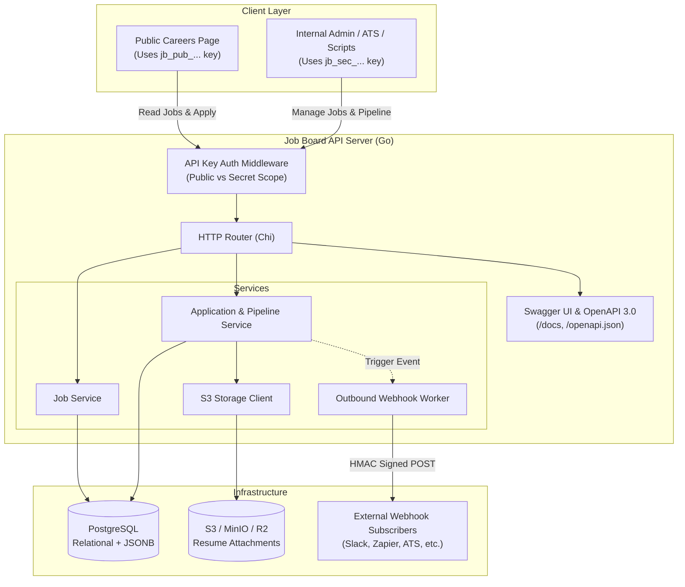

# System Architecture & Tech Stack

## 1. System Overview

A high-performance, single-tenant, headless REST API built with **Go** and backed by **PostgreSQL** and **S3-compatible object storage**. Designed for zero-friction self-hosting via Docker Compose, allowing any organization to deploy their own backend and connect their custom career pages, internal dashboards, and workflow automations.

---

## 2. Core Decisions & Tech Stack

| Component | Technology | Rationale |
| :--- | :--- | :--- |
| **Language & Runtime** | Go 1.22+ | Single static binary, low memory footprint (~20MB), high throughput, easy containerization |
| **HTTP Router / Web Framework** | `chi` | Lightweight, idiomatic `net/http` compatibility, composable middleware |
| **Database** | PostgreSQL 15+ | ACID compliance, `JSONB` for dynamic custom application form fields, indexing |
| **Migrations** | `golang-migrate` (embedded) | Auto-migrates database on startup or via CLI subcommands |
| **Object Storage** | AWS S3 SDK (`aws-sdk-go-v2`) | Compatible with AWS S3, Cloudflare R2, MinIO, Google Cloud Storage, Wasabi |
| **API Documentation** | OpenAPI 3.0 / Swagger UI | Embedded UI at `/docs` and raw spec at `/openapi.json` for client/SDK generation |
| **Rate Limiting** | In-Memory Token Bucket (`golang.org/x/time/rate`) | Zero external dependencies (no Redis required); tracks burst/RPS per client IP in process memory |
| **Deployment** | Docker & Docker Compose | Pre-configured `docker-compose.yml` with PostgreSQL and the API server |
 
 ---
 
## 3. Layer Invariants & Architectural Rules
1. **Domain Layer (`internal/domain`)**:
   - Holds core entities (`Job`, `Application`, `ApiKey`, `WebhookSubscription`), repository interfaces, domain error types, and business validation functions (e.g. `ValidateCustomAnswers`).
   - Completely decoupled from HTTP frameworks, SQL drivers, and AWS SDKs.
2. **Transport & API Layer (`internal/api/v1`, `internal/api/httputil`)**:
   - Handles HTTP decoding, route multiplexing, status codes, query parsing, multipart parsing, and request DTO validation.
   - Shared HTTP response and error envelopes live in `internal/api/httputil` to prevent circular dependencies.
   - Must use typed error assertions (`errors.As`), never string substring searches.
3. **Service Layer (`internal/service`)**:
   - Pure business orchestration: fetches entities from repositories, checks business rules, coordinates storage uploads, and persists results.
   - Never contains low-level regexes, string parsing, or inline format validators.
4. **Explicit Dependency Injection**:
   - Constructors (`NewService`, `NewRouter`, `NewPublicHandler`) must take their required dependencies explicitly and never silently instantiate mock fallbacks in production paths.
